<div align="center">

# 🌍 IMEPointer

### I'm e-Pointer that utilizes color pointers & multi-language key-layouts 
(English, Korean, Pali, Japanese)

### 컬러 마우스 포인터와 다국어 입력 모드를 지원하는 고성능 IME 상태추적 유틸리티


</div>

<br>

## 💡 개발 동기 (Why IMEPointer?)

컴퓨터로 문서 작업을 할 때, 다양한 언어와 특수기호를 입력하기 쉽도록 설계되었습니다.

#### 🎯 1. 마우스 포인터로 입력 상태를 한눈에 파악

> "문자 입력 상태에 따라 마우스 포인터의 색상이 변한다면, 컴퓨터 문서 작업에 얼마나 도움이 될까?"

- **문제**: 한글, 영어, 특수기호 모드를 번갈아 사용할 때 현재 모드를 놓치기 쉬움
- **해결**: 마우스 포인터와 트레이 아이콘의 색상으로 **입력 상태를 즉각적 시각화**
- **효과**: 타이핑 오류 감소, 작업 효율 증대

#### 🎯 2. 한글/Caps 상태를 창의적으로 재활용

> "한글 입력 상태에서 Caps Lock이 무의미한데, 이걸 특정 언어의 문자 입력 모드로 활용할 수 있지 않을까?"

- **기존 문제**: Caps Lock은 영어에서만 의미 있음
- **새로운 활용**: 한글/Caps 상태에서 **공학용 특수기호, Pali어, 일본어** 등의 입력 모드로 재구성
- **효과**: 최소 키 입력으로 최대 다양한 모드 지원

#### 🎯 3. 초기 불교 문헌 연구 지원

> "기존 Pali어 자판이 있으나, Sanskrit까지 포함한 글자판이 있다면 초기불교 문헌 정리에 도움이 될 것 같다."

- **Pali어 + Sanskrit**: Pali 문자 (ā, ī, ū, ṛ, ḷ, ṃ, ṇ, ṭ, ḍ, ś, ṣ, ḥ) + Sanskrit 추가문자 (ṝ, ḹ)
- **효과**: 빨리 경전 및 산스크리트 텍스트 직접 입력 가능
- **대상**: Pali/Sanskrit 언어학자, 초기불교 연구자, 고전 문헌 전문가

#### 🎯 4. 한글의 글자 조합 원리를 일본어에 적용

> "한글의 자음+모음 글자 조합 원리를 일본어 문자에도 적용할 수 있지 않을까?"

- **한글 원리**: 자음(19개) + 모음(21개) → 무한한 글자 조합
- **일본어 응용**: 자음(consonant) + 모음(vowel) → 히라가나/가타카나 조합
- **결과**: **일본어1 (조합형)** 및 **일본어2 (3-Layer)** 입력 모드 개발
- **효과**: 일본어에 정통하지 않은 사용자도 직관적인 입력 가능


<br>

## ✨ 주요 기능 (Key Features)

### 1️⃣ 입력 상태별 5가지 색상 테마 제공
### 2️⃣ 한글/CAPS 상태에서 4가지 입력 모드 선택

- 입력 모드가 변경되면 마우스 포인터와 트레이 아이콘의 색깔이 **즉각적으로** 변합니다.
- **한자키** (RCtrl): 영어 소문자 ↔ 한글CAPS 입력모드

<div align="center">

| 입력 상태 | 포인터 색상 | 트레이 문자 | 설명 |
|:---|:---|:---:|:---|
| **영어 소문자** | $\color{white}\Large\blacktriangle$ White | $\color{gray}\large\boldsymbol{e}$ | 영어 소문자 입력 (CAPS Off) |
| **영어 대문자** | $\color{DeepSkyBlue}\Large\blacktriangle$ DeepSkyBlue | $\color{deepskyblue}\large\textbf{E}$ | 영어 대문자 입력 (CAPS On) |
| **한글** (기본) | $\color{red}\Large\blacktriangle$ Red | $\color{red}\large\textbf{K}$ | 한글 입력 (Caps Off) |
| **공학 특수기호** | $\color{orange}\Large\blacktriangle$ Orange | $\color{orange}\large\textbf{S}$ | **한글CAPS** + 그리스문자, 수학기호 |
| **Pali/Sanskrit** | $\color{orange}\Large\blacktriangle$ Orange | $\color{orange}\large\textbf{P}$ | **한글CAPS** + 빨리/산스크리트 문자 |
| **Pali Unicode** | $\color{orange}\Large\blacktriangle$ Orange | $\color{orange}\large\textbf{p}$ | Us + Pali unicode 설치시 || **일본어1** (조합형) | $\color{lime}\Large\blacktriangle$ Lime | $\color{lime}\large\textbf{J}$ | **한글CAPS** + 자음/모음 조합 |
| **일본어2** (3-Layer) | $\color{lime}\Large\blacktriangle$ Lime | $\color{lime}\large\textbf{J}$ | **한글CAPS** + 3Layer에 76자 배치 |
| **Japanese IME** | $\color{lime}\Large\blacktriangle$ Lime | $\color{lime}\large\textbf{j}$ | 일본어 IME 설치시 |

</div>

<div align="center">

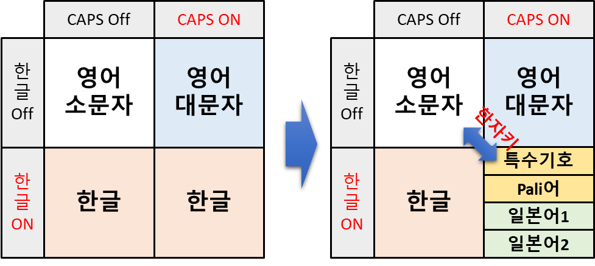

</div>


### 3️⃣ 현재 입력모드의 키보드 배열창을 실시간으로 표시

- 트레이 메뉴에서 입력모드 선택시 해당 키보드 배열 그림을 보여줌 (Always On Top)
- 한자키로 입력모드/Layer 전환시 해당 키보드 배열 그림으로 변경함
- Shift키 반응하여 키보드 배열 그림 변경

### 4️⃣ 입력문자 표시창으로 문자 입력확인 및 학습보조

- **한글/CAPS 모드**에서 키보드로 입력한 문자를 화면에 표시
- 일본어1 조합모드에서 "대표자음 + あ행모음 → 조합문자" 변환 표시
- 일본어/Pali어에서 HK/YN/PE 전환키 사용시 글자 전환 표시
- 한자키로 입력모드/Layer 전환시 현재 입력모드/Layer 표시

### 5️⃣ 아래한글(hwp)과 엑셀(excel)에서 포인터 하단에 작은원(mini indicator) 표시

- 마우스 포인터를 자체적으로 관리하는 앱(한글,엑셀)에서는 포인터 우측 하단에 **'작은 원'**을 생성하고 입력 상태에 따라 색상을 변경합니다.

  ⚠️ Microsoft Excel (`excel.exe`)의 셀 위에서는 포인터가 흰색 십자가 형태로 바뀐다.
  
  ⚠️ 한글과컴퓨터 아래한글 (`hwp.exe`)의 텍스트 입력창 안에서는 포인터가 검은색 I자로 바뀐다.

### 6️⃣ 트레이 아이콘 **클릭**하여 메뉴 선택하고, 옵션 On/Off

<div align="center">

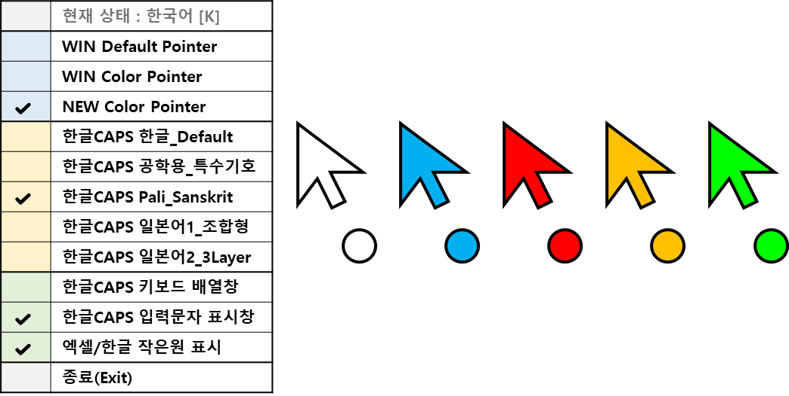

</div>

<br>

## 💡 사용팁 (Tips)

### 1️⃣ Pali어 / Sanskrit 키보드 설치 및 사용

#### 📌 한글CAPS Pali_Sanskrit 사용 (IMEPointer 앱 제공)

1. 트레이 메뉴에서 "한글CAPS Pali_Sanskrit" 선택 (한글 입력 모드 + CAPS Lock On)
2. "한글CAPS 키보드 배열창" 메뉴 선택시 Pali/Sanskrit어 키보드 배열 그림을 보여줌
3. 비어있는 문자에는 인문학 문서편집에 자주 사용되는 특수기호를 배치함

<div align="center">

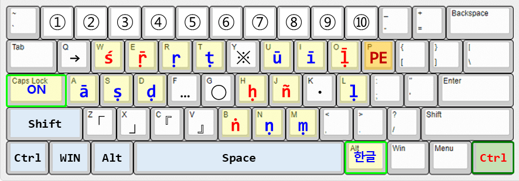
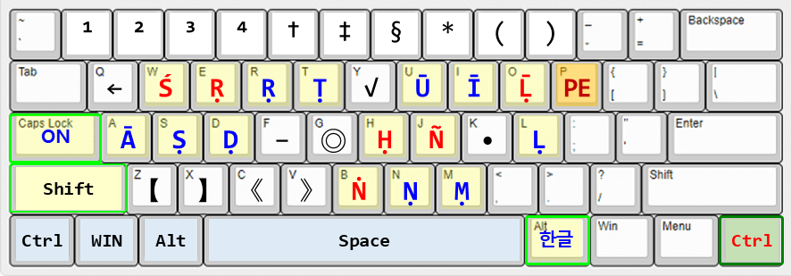

</div>

4. **PE키(P)** 전환기능 : 선택된 글자가 다음 순서로 순환한다.

- 다수의 글자를 선택하고 PE키를 누르면, 첫번째 글자의 전환과 동일한 전환이 적용된다.
- None(영어) → Dot below → Macron → Dot below+Macron → Dot above → Accent → Tilde  → None (영어)

<div align="center">

|None|Dot_below|Macron|Dot_below+Macron|Dot_above|Accent|Tilde|
|:---:|:---:|:---:|:---:|:---:|:---:|:---:|
|**a**|-|**ā**|-|-|-|-|
|**d**|**ḍ**|-|-|-|-|-|
|**h**|**ḥ**|-|-|-|-|-|
|**i**|-|**ī**|-|-|-|-|
|**l**|**ḷ**|-|**ḹ**|-|-|-|
|**m**|**ṃ**|-|-|-|-|-|
|**n**|**ṇ**|-|-|**ṅ**|-|**ñ**|
|**t**|**ṭ**|-|-|-|-|-|
|**u**|-|**ū**|-|-|-|-|
|**r**|**ṛ**|-|**ṝ**|-|-|-|
|**s**|**ṣ**|-|-|-|**ś**|-|

</div>

5. 한자키/한영키/CAPS키 전환기능
- **한자키** (RCtrl): 영어 소문자 ↔ Pali
- **한영키** (RAlt): 영어 대문자 ↔ Pali
- **CAPS** : 한글 ↔ Pali

#### 📌 US+Pali Unicode IME 사용 (기존자판)

* US+Pali(Unicode) IME 설치 : `https://www.tipitaka.org/keyboard.html`

* 한국어(MS IME) ↔ Pali 빠른 전환 : $\color{lime}\textbf{Ctrl}$ + $\color{lime}\textbf{Shift}$

* 자판 목록에서 순환 선택 : $\color{deepskyblue}\textbf{WIN}$ + $\color{deepskyblue}\textbf{Space}$

* Pali 문자 입력 : $\color{red}\textbf{한/영키}$ (Right Alt) + ($\color{red}\textbf{A, S, D, R, T, Y, U, I, G, H, L, M, N}$)

<div align="center">

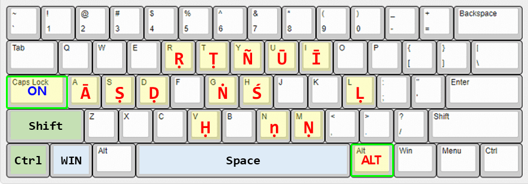

</div>

#### 📌 Pali-Sanskrit Unicode IME 사용 (수정자판)

* Pali-Sanskrit(Unicode) 키보드 설치 : [palisans_unicode.zip](https://github.com/stonkim93/IMEPointer/palisans_unicode.zip)

* 기존 Pali어 문자에 Sanskrit 전용 문자(**ṝ**, **ḹ**)를 추가함.
* 직관적인 위치로 문자를 재배치함.
* US+Pali(Unicode) IME와 설치방법 및 사용방법은 동일함.

<div align="center">

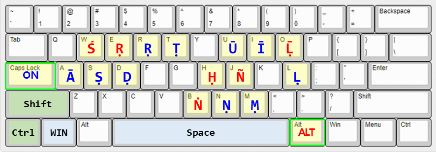

</div>

### 2️⃣ 일본어 입력하기

#### 일본어1_조합형(Layer1)

1. 트레이 메뉴에서 "한글CAPS 일본어1_조합형" 선택 (한글 입력 모드 + CAPS Lock On)
2. 자음(왼손)과 모음(오른손)을 조합하여 히라가나/가타카나 글자를 생성함.
- 대표자음 + あ행모음 → 조합문자
- 예시: さ + い → し
- 대표자음 : 행(かさたなはまらがざだばぱ)을 대표하는 자음
- あ행모음 : あいうえお
3. 2종류의 대표자음 배치를 제공
- **Layer1** : 대표자음을 청음은 あ단, 탁음은 お단, 반탁음은 う단으로 선정함.

<div align="center">

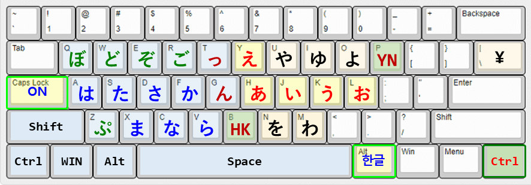
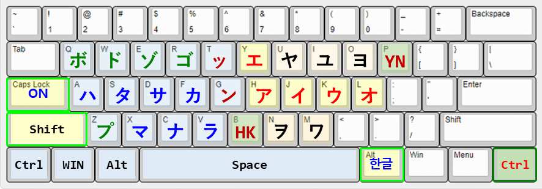

</div>

- **Layer2** : 각행의 대표자음을 자주 사용하는 자음으로 선정하여, 빠른 입력이 가능하도록 고려함.

<div align="center">

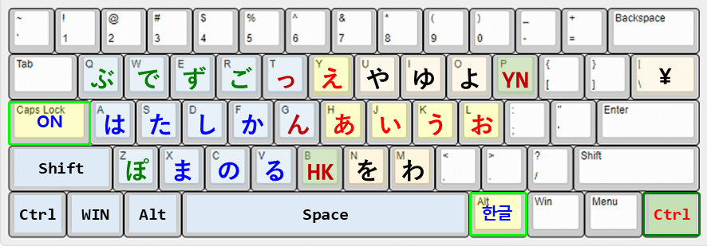
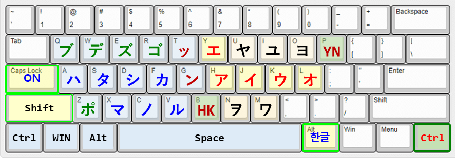

</div>

4. 인체공학적 자판 배치
- 왼손 자음은 50음도의 역방향으로, 오른손 모음은 순방향으로 배열함. 
- 사용빈도를 고려하여 え단과	お단의 순서를, わ와 を의 순서를 바꾸어 배열함.
- 엔화 기호(¥)를 backslash(\) 위치에 배치하였다.

5. 한자키/HK/YN 전환기능
- **한자키** (RCtrl): Layer1 ↔ Layer2
- **HK** 전환키(B): 히라가나(H) ↔ 가타카나(K)
- **YN** 전환키(P): 청음 → 탁음 → 반탁음 → 작은글자 → 청음
** 다수의 글자를 선택하고 HK/YN키를 누르면, 첫번째 글자의 전환과 동일한 전환이 적용된다.

<div align="center">

|청음|탁음|반탁음|작은글씨|동일유형|
|:---:|:---:|:---:|:---:|:---|
|**か**|**が**|-|-|か행,さ행,た행|
|**な**|**ば**|**ぱ**|-|は행(はひふへほ)|
|**つ**|**づ**|-|**っ**|つ,う|
|**や**|-|-|**ゃ**|あ,い,う,え,お,や,ゆ,よ,わ|
|**ん**|-|-|-|な,ま,ら,を,ん|

</div>

#### 일본어2 (3-Layer)

1. 트레이 메뉴에서 "한글CAPS 일본어2_3Layer" 선택 (한글 입력 모드 + CAPS Lock On)
2. 인체공학적 자판 배치
- 왼손 자음은 50음도의 역방향으로, 오른손 모음은 순방향으로 배열함. 
- 사용빈도를 고려하여 え단과	お단의 순서를, わ와 を의 순서를 바꾸어 배열함.
- 엔화 기호(¥)를 backslash(\) 위치에 배치하였다.

3. 히라가나 문자 배치도
- 3개의 Layer에 76자의 일본어 문자를 배치함.
- **Layer1**: 청음(か,さ,た)+반탁음(ぱ) + 촉음(っ) + 기본모음(あ,い,う,え,お)
- **Layer2**: 탁음(が,ざ,だ,ば) + ゔ + 나머지 모음(や,ゆ,よ,わ,を)
- **Layer3**: 나머지 청음(な,ま,ら,な) + ん + 요음(ゃ,ゅ,ょ) + HK키 + YN키
<div align="center">

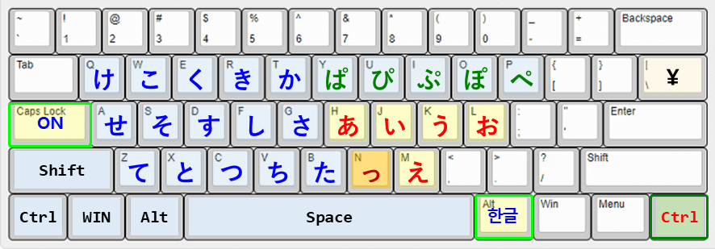
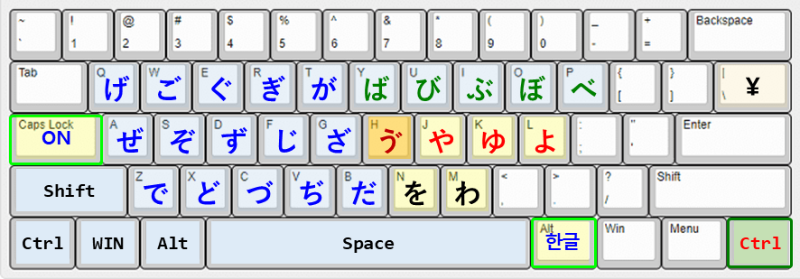
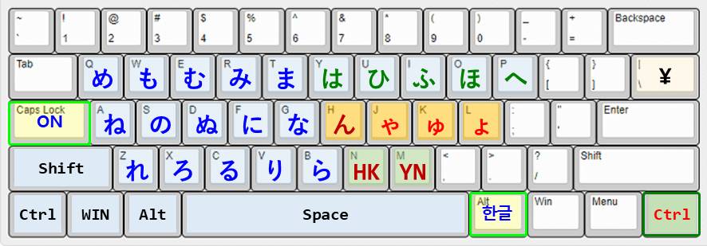

</div>

4. 가타카나 문자 배치도

<div align="center">

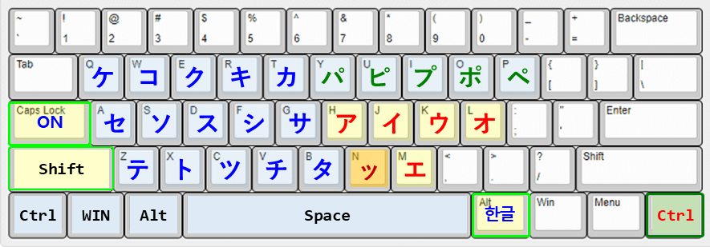
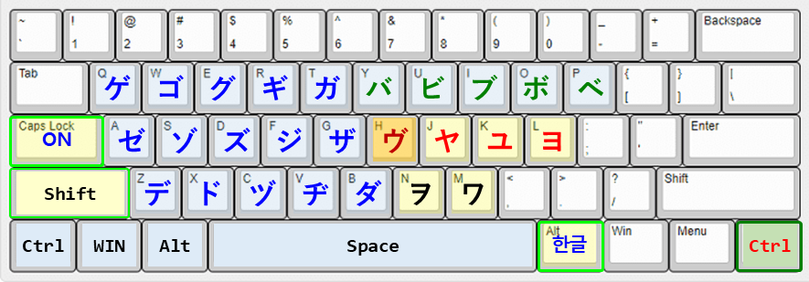
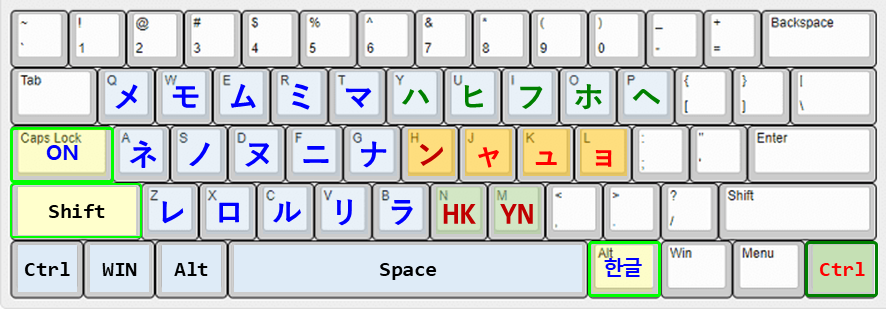

</div>

5. 한자키/HK/YN 전환기능
- **한자키** (RCtrl): Layer1 ↔ Layer2
- **HK** 전환키(B): 히라가나(H) ↔ 가타카나(K)
- **YN** 전환키(P): 청음 → 탁음 → 반탁음 → 작은글자 → 청음
** 다수의 글자를 선택하고 HK/YN키를 누르면, 첫번째 글자의 전환과 동일한 전환이 적용된다.

6. 일본어 한자 입력방법
- 일본어 IME 설치후, 일본어 글자를 1개 선택하고 Spacebar를 눌러서 한자 변환이 가능하다.

7. 일본어 문자 배치에 참고한 정보
- 촉음은 かさたぱ 다음에 받침(K,S,T,P)에 해당하는 소리로, 글자 'つ'를 작게 쓴 'っ'로 표기한다. 
- 촉음은 오직 청음(かさた), 반탁음(ぱ)과 사용된다.
- 비음(ん)은 대부분의 글자와 결합하지만, 상대적으로 청음보다 탁음.반탁음과 많이 사용된다.
- ゔ(ヴ)는 영어 V 발음용으로 탁음기호가 허용된 사례이다.
- 요음(ゃゅょ)은 청음 い단(きしちにひみり)과 많이 결합한다.
- あ행이 스테가나(요음처럼 작은 글씨)로 쓰이는 경우는, 외래어 표기(f,t,d,w,ts,v), 한국어의 종성 표현, 만화에서 말끝을 흐릴때 등이다.


### 3️⃣ 공학용 특수기호 입력하기

1. 트레이 메뉴에서 "한글CAPS 공학용_특수기호" 선택 (한글 입력 모드 + CAPS Lock On)
2. 자주 사용하는 그리스어 문자와 수학, 공학 기호를 배치함.
- 숫자열에는 원 영어 소문자, 화살표를 배치함.
3. 한자키/한영키/CAPS키 전환기능
- **한자키** (RCtrl): 영어 소문자 ↔ 공학용 특수기호
- **한영키** (RAlt): 영어 대문자 ↔ 공학용 특수기호
- **CAPS** : 한글 ↔ 공학용 특수기호

<div align="center">

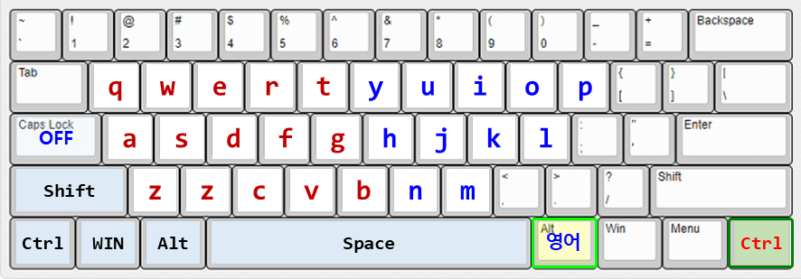
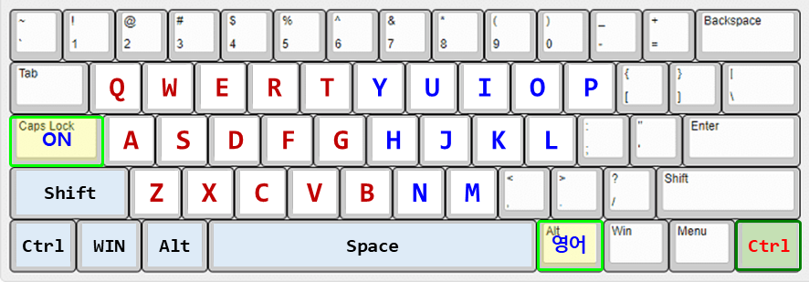

</div>

4. 참고사항 : (한글자음+한자키) 특수기호 모음
- ㄱ + 한자키 : 문장 부호 (', ", ·, ㆍ 등)
- ㄴ + 한자키 : 괄호 기호 ([, ], 「, 」 등)
- ㄷ + 한자키 : 수학 기호 (+, -, ×, ÷, = 등)
- ㄹ + 한자키 : 단위 기호 (㎜, ㎝, ㎤, ㎡ 등)
- ㅁ + 한자키 : 도형 기호 (★, ☎, ◀, ◆ 등)
- ㅂ + 한자키 : 선 기호 (│, ─, ┼ 등)
- ㅅ + 한자키 : 괄호 문자 (㉠,㈀)
- ㅇ + 한자키 : 원 숫자/영어, 괄호 숫자/영어 (ⓐ, ①, ⒜, ⑴)
- ㅈ + 한자키 : 아리비아 숫자, 로마 숫자 (1, 2, Ⅰ, Ⅱ 등)
- ㅊ + 한자키 : 분수, 위첨자/아래첨자 숫자 (½,¹, ₁)
- ㅋ + 한자키 : 현대한글 자음/모음 (ㄲ,ㄶ,ㅐ,ㅚ)
- ㅌ + 한자키 : 훈민정음 자음/모음 (ㅸ,ㆆ,ㅿ,ㆎ,ㆇ)
- ㅎ + 한자키 : 그리스 문자 (Δ, Ω, α, β 등)

### 4️⃣ 아래한글에서 윈도우 MS IME 사용하기

> 📌 [TIP]
> 한글과컴퓨터의 자체 입력기 대신 Microsoft IME를 사용하도록 전환하면, 아래한글에서도 IMEPointer가 입력 상태를 정확히 표시합니다.

* 아래한글 실행 후 상단 메뉴에서 `도구 ➔ 글자판 ➔ 글자판 바꾸기` 클릭 (단축키: <kbd>Alt</kbd> + <kbd>F2</kbd>)
* **글자판 바꾸기** 창에서 현재 글자판을 **한국어** 대신 $\color{lime}\textbf{윈도우\ 입력기}$로 변경
* **글자판 자동 변경** 해제하여 항상 윈도우 설정을 따르도록 저장
* 트레이 아이콘을 클릭하여 **엑셀/한글 작은원 표시**가 체크되면, 입력 상태를 시각적으로 구분하기 쉬움

### 5️⃣ 윈도우 시작 프로그램에 추가하기

* 윈도우 실행창(run)을 띄운다 : <kbd>WIN</kbd> + <kbd>R</kbd>
* 윈도우 시작프로그램 폴더를 연다 : `shell:startup`
* IMEPointer.exe 바로가기 파일을 생성하여 시작프로그램 폴더에 붙여넣는다
* IMEPointer 실행 후 숨겨진 아이콘 박스에 포함된 경우, 작업표시줄로 끄집어내어 MS IME 옆에 놓으면 시각적으로 도움이 된다

<br>

## 🏃 초보 개발자를 위한 정보

### ⚙️ 요구 사항

| 항목 | 내용 |
|:---|:---|
| 🖥️ **OS** | Windows 10 / Windows 11 (64-bit) |
| 🧩 **Runtime** | [.NET 10.0 Desktop Runtime](https://dotnet.microsoft.com/download/dotnet/10.0) 이상 |
| ⌨️ **Language** | C# 12 / 13 |
| 🛠️ **IDE** | Visual Studio 2022 / 2026 |

### 1️⃣ 레포지토리 클론

```bash
git clone https://github.com/stonkim93/IMEPointer.git
```

### 2️⃣ 빌드 & 배포판 만들기

Visual Studio에서 `IMEPointer.csproj`를 열고 빌드합니다.

#### 📌 조건부 컴파일 (Optional Features)

`IMEPointer.csproj` 파일에서 메뉴 활성화 스위치(true/false)를 변경할 수 있다. 

```xml
  <PropertyGroup>
    <EnableKeyboardLayout>true</EnableKeyboardLayout> <!-- 키보드 배열창 표시 -->
    <EnableCapsEngineer>true</EnableCapsEngineer>     <!-- 공학용 특수기호 -->
    <EnableCapsPali>true</EnableCapsPali>             <!-- Pali/Sanskrit -->
    <EnableCapsJapanese1>true</EnableCapsJapanese1>   <!-- 일본어1 조합형 -->
    <EnableCapsJapanese2>true</EnableCapsJapanese2>   <!-- 일본어2 3Layer -->
  </PropertyGroup>
```

#### 프레임워크 의존형 (소용량)

```bash
dotnet publish -c Release -r win-x64 --self-contained false /p:PublishSingleFile=true
```

#### .net10 런타임 포함형 (대용량)

```bash
dotnet publish -c Release -r win-x64 --self-contained true /p:PublishSingleFile=true /p:IncludeNativeLibrariesForSelfExtract=true
```

### 3️⃣ 4가지 실행 파일 다운로드

오른쪽의 **[Releases]** 탭에서 최신 버전의 `.zip` 파일을 다운로드 하고 압축을 해제합니다.

| 파일명 | 용도 | 파일크기(KB) |
|:---|:---|---:|
| [IMEPointer_full.zip](https://github.com/stonkim93/IMEPointer/releases/download/IMEPointer/IMEPointer_full.zip) | Color Pointer + 4가지 Key-layout | 3,190 |
| [IMEPointer_Pali.zip](https://github.com/stonkim93/IMEPointer/releases/download/IMEPointer/IMEPointer_Pali.zip) | Color Pointer + Pali_Sanskrit | 1,357 |
| [IMEPointer_Japanese.zip](https://github.com/stonkim93/IMEPointer/releases/download/IMEPointer/IMEPointer_Japanese.zip) | Color Pointer + 일본어1, 일본어2 | 2,618 |
| [IMEPointer_only.zip](https://github.com/stonkim93/IMEPointer/releases/download/IMEPointer/IMEPointer_only.zip) | Color Pointer 기능만 | 489 |

### 4️⃣ 실행하기

`IMEPointer.exe`를 실행하면 시스템 트레이에서 즉시 작동합니다.

> 📌 [IMPORTANT]
> 중복 실행 방지(`Mutex`)가 내장되어 있어 안전하게 백그라운드에서 상주합니다.

<br>

## ⚡ 기술적 특징 및 최적화 (Technical Highlights)

> 📌 [NOTE]
> 이 앱은 백그라운드에서 365일 실행되어도 시스템에 전혀 무리를 주지 않도록, 초경량·고성능을 목표로 가혹하게 최적화되었습니다.

### 1️⃣ 다중 입력 상태 관리 (Multi-State IME Engine)

* **9가지 입력 상태 추적**: 기존의 5가지 상태(영어/한글/Pali)에서 9가지로 확장
  - 기본 상태: 영어 소/대문자, 한글, Pali IME, 일본어 IME
  - 한글CAPS 모드: 공학용, Pali/Sanskrit, 일본어1, 일본어2

* **상태 전환 엔진**: 언어 변경, Caps Lock, 한자키 입력을 감지하여 자동 상태 전환

* **컨텍스트 동기화**: 창 전환 시에도 입력 상태를 정확히 유지

### 2️⃣ 해상도 및 배율에 반응하는 반응형 시각화 (Dynamic Scaling)

* **마우스 포인터 크기 동기화**: 사용자가 윈도우 설정에서 포인터 크기를 변경하거나 모니터 DPI를 변경하면 즉시 감지

* **고해상도 렌더링**: 커서가 커져도 이미지를 단순 확대하지 않고, 변경된 배율에 맞춰 **기하학적 형태와 외곽선 두께를 고해상도로 다시 계산**하여 항상 선명한 커서 제공

* **작은 원 위치 동기화**: 엑셀/한글의 작은 원도 포인터 크기에 비례하여 정확히 이동

💡 접근성 설정의 포인터 크기 변경에 따라 포인터 크기 배율을 정확히 계산하고, 커진 포인터를 고해상도로 다시 그리는데 어려움이 있다. 현재는 고해상도로 포인터를 다시 그리기는 하지만, 윈도우 기본 포인터가 커지는 것보다 새로 그린 포인터가 2배 정도 더 크다.


### 3️⃣ 문맥을 놓치지 않는 스마트 입력 감지 (Smart Context Tracking)

* **3중 감지 엔진**:
  - ① 하드웨어 키보드 신호 직접 가로채기 (GlobalKeyboardHook)
  - ② 입력창에 직접 상태 질의하기 (IME Query API)
  - ③ 윈도우 레지스트리 상태 확인 (Registry Monitoring)
  - 이를 통해 메모장, 엑셀, 게임, 보안 프로그램 등 어떤 환경에서도 정확한 상태 감지

* **창 포커스 추적**: 바탕화면이나 작업표시줄을 클릭했다가 돌아올 때 **이전 창과 언어 상태를 기억**하고 원래대로 복구

* **특수앱 최적화**: Excel, 아래한글, 게임 등 각 앱의 특성에 맞춘 별도의 감지 로직

💡 "문자 입력창", "키보드 배열창", "작업표시줄", "트레이 아이콘"의 입력상태를 동기화 했으나, 트레이 메뉴를 선택하기 위해 마우스로 아이콘을 클릭하는 순간, 트레이 아이콘이 문자 입력창의 입력모드에서 영어 소문자(Caps Off일때) 또는 영어 대문자(Caps On일때)의 입력상태로 변한다. 

### 4️⃣ 메모리 낭비 제로, 극한의 성능 최적화 (Zero GC & Resource Management)

* **마우스 끊김 원천 차단 (Zero GC)**:
  - 30ms마다 마우스를 감지하면서도 임시 공간(Stack)만 사용하고 즉시 비워버리는 특수 설계
  - 가비지 컬렉터가 개입할 여지를 없애 **마우스가 단 1ms도 끊기지 않음**

* **컬러 포인터 캐싱**: 자주 사용하는 컬러 포인터를 메모리에 캐시하여 반복 생성 방지

* **완벽한 자원 관리**: 색상이 바뀔 때마다 생성되는 비트맵을 사용 직후 즉시 파괴(`DeleteObject`)하여 메모리 누수 차단

### 5️⃣ 외부 충돌 및 오류에 대비한 철벽 안전망 (Bulletproof Safety)

* **Thread-Safe 설계**: 듀얼 모니터 연결, 해상도 변경 시 발생하는 레이스 컨디션 차단

* **강제 종료 시 자동 복구**: 예기치 못한 에러나 업데이트로 프로그램이 강제 종료되더라도 **윈도우 원래의 하얀색 마우스 커서로 자동 복구**

* **예외 처리**: 모든 주요 진입점에 try-catch 및 finally 블록으로 리소스 누수 방지

## 📜 라이선스 (License)

이 프로젝트는 **MIT License**에 따라 자유롭게 수정 및 배포할 수 있습니다.

Made with ❤️ for multilingual writers, scholars, engineers, and Pāḷi researchers

<br>

---

💬 **문의 및 기여**: GitHub Issues를 통해 버그 리포트, 기능 제안, 풀 리퀘스트를 환영합니다!

<br>

❤️🌍✨⚡🚀💡🎯🆕🖥️💻⌨️🔤🎨🧩🐛🔹📐📝✅🏆
